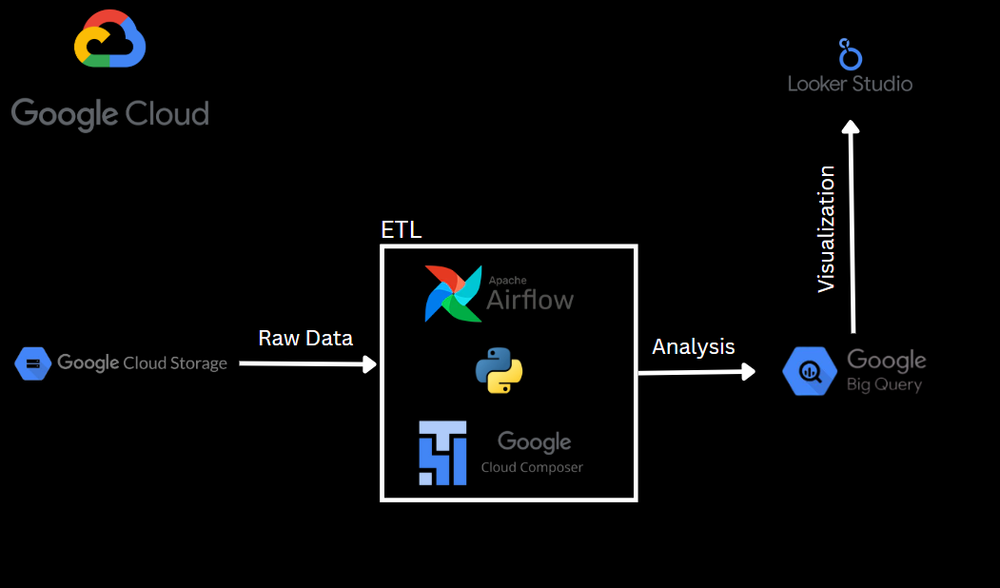

# Uber Data ETL & Analytics | GCP Project

## Introduction
This project aims to extract, transform, and load (ETL) Uber data stored on Google Cloud Storage into BigQuery using Apache Airflow. The data will then be analyzed using Looker Studio to derive valuable insights. The project leverages Cloud Composer (Managed Apache Airflow) for pipeline orchestration and a VM on Google Cloud Compute Engine for Airflow installation and configuration.

## Architecture

## Technologies Used
- Programming Language - Python
1. Google Cloud Storage
2. Apache Airflow
3. Google Cloud Composer
4. Google BigQuery
5. Looker Studio

## Dataset Used
The dataset contains Uber trip records with fields such as pick-up and drop-off dates/times, locations, trip distances, fares, rate types, payment types, and passenger counts. 

## Data Model

## Workflow Overview

Data Ingestion:
1. Raw data is uploaded to a public URL.
2. The data is fetched using GCP hooks.

Data Transformation:
1. Applied transformations on the raw data to align with the predefined data model using Python.

Data Loading:
1. Transformed data is loaded into Google BigQuery for analysis using Airflow.

Data Visualization:
1. SQL queries are performed on BigQuery for analytical insights.
2. The processed data is visualized using Looker Studio to create dashboards.

Key Features  
1. Scalable and efficient ETL pipeline.
2. Seamless integration with cloud-native tools.
3. Automation using Apache Airflow DAGs.

## Visualization Dashboard
- **Looker Studio Link**: https://lookerstudio.google.com/reporting/2a610636-8521-4614-aa43-4691bd903d39

This project follows a modern data engineering approach using GCP and Apache Airflow to automate the Uber data ETL pipeline and enable analytics through BigQuery and Looker Studio.
